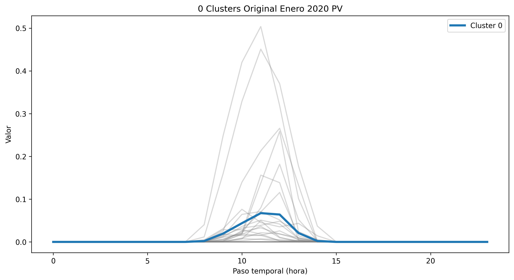
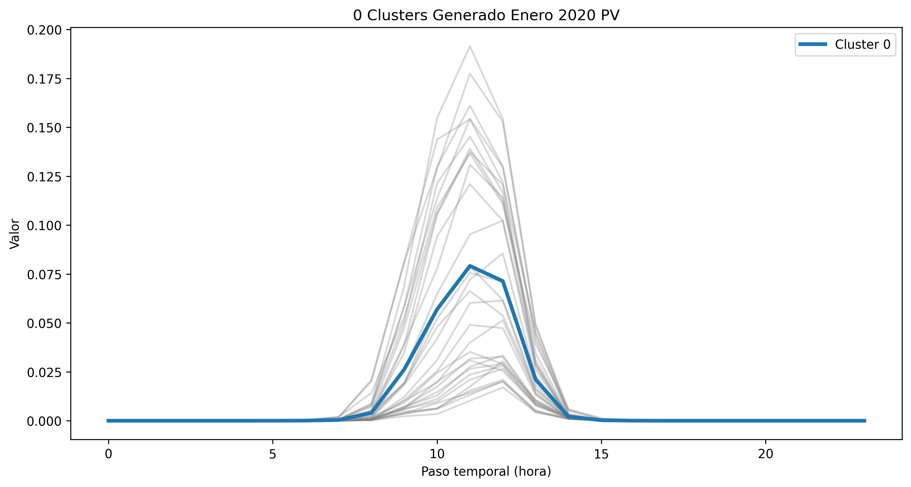
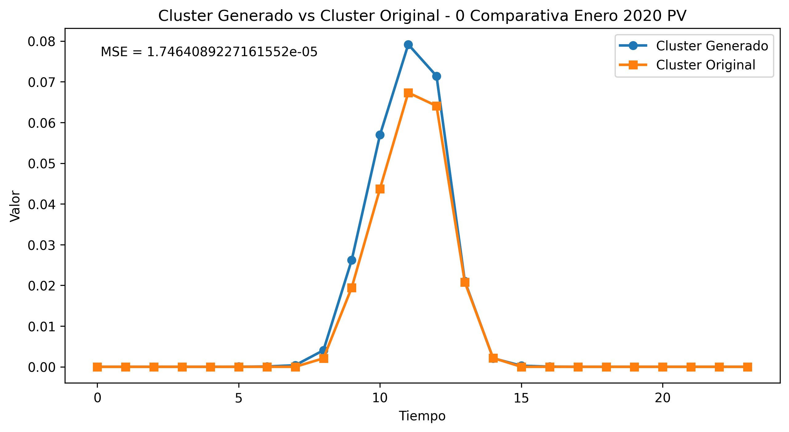

#  Month-Conditioned Variational Autoencoder for Joint Energy and Meteorological Scenario Generation

Este repositorio contiene la implementación de un **Conditional Variational Autoencoder (CVAE) condicionado por el mes del año**, diseñado para generar **escenarios sintéticos realistas** de variables energéticas y meteorológicas.  
El modelo aprende distribuciones multivariadas complejas a partir de datos históricos y permite simular perfiles completos diarios de 24 horas con coherencia física y temporal.

---

## 📌 Características principales

- ✔️ Generación **simultánea** de múltiples variables: clima, producción solar, producción eólica, demanda, radiación, velocidad del viento y más.  
- ✔️ Modelo **probabilístico** basado en CVAE utilizando variables latentes gaussianas.  
- ✔️ Condicionamiento por **mes del año** mediante *one-hot encoding*.  
- ✔️ Arquitectura Encoder–Latent Space–Decoder optimizada con ReLU + Adam.  
- ✔️ Métricas implementadas: MSE, MAE, PSNR, Z-Norm, Z-Var.  
- ✔️ Evaluación con **Time Series Clustering** para comparar centroides reales vs sintéticos.  
- ✔️ Reproducción fiel de patrones determinísticos (p. ej., generación solar).  
- ✔️ Buena representación de variables estocásticas (p. ej., viento).

---

## 📊 Datos utilizados

Los datos consisten en una serie temporal multivariable con:

- **9000+ registros**
- **44 variables climáticas y energéticas**
- Resolución: **1 hora**
- Agrupadas en matrices diarias de **24 × 44**

---

## 🏗️ Arquitectura del CVAE

### 🔸 Encoder
- Entrada: matriz diaria aplanada + vector condicional (mes)
- Capas densas con activación ReLU
- Salida:  
  - μ (media)  
  - σ (desviación estándar)  

### 🔸 Decoder
- Entrada: z + condición mensual
- Reconstruye matriz de 24×44

### 🔸 Función de pérdida (ELBO)
Loss = BCE + KL

---

## 🚀 Entrenamiento

**Parámetros principales:**

- Latent dimension: **20**
- Épocas: **200**
- Optimizador: **Adam**
- Condición: **One-Hot Encoding de 13 meses**
- Batch size sugerido: 64

---

## 📈 Resultados

Evaluación por **Time Series Clustering**, comparando centroides reales vs generados.

### 🔹 Producción Fotovoltaica
- MSE ≈ 1.74×10⁻⁵  
- Reproducción casi perfecta del perfil solar
- 
- 
- 

### 🔹 Producción Eólica
- MSE ≈ 1.39×10⁻⁵  
- Buena aproximación pese a su naturaleza estocástica

---

## 📜 Cita

> “Month-Conditioned Variational Autoencoder for Joint Energy and Meteorological Scenario Generation”,  
> Corella Paul, Acuña Byron, Cherrez Diana and Grijalva Felipe USFQ – 2025.

